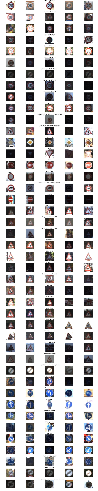
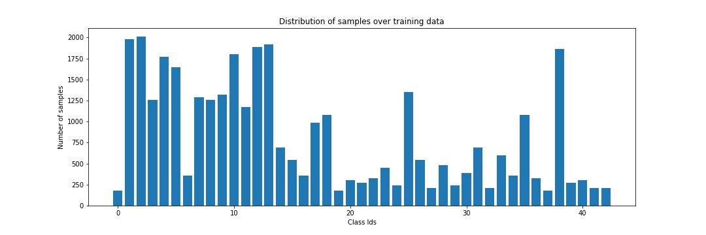
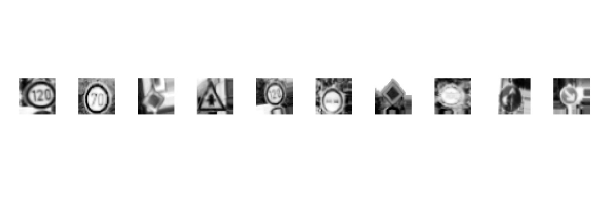
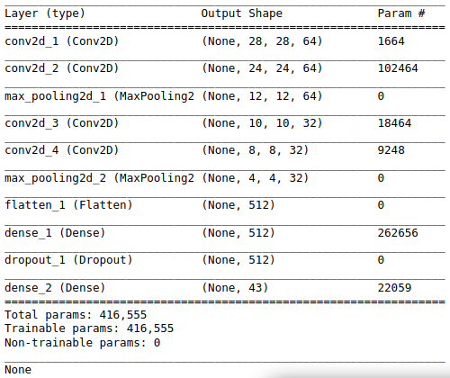
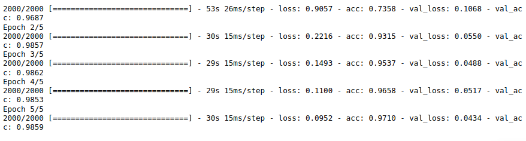
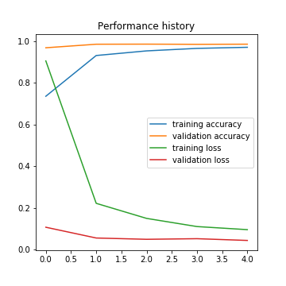
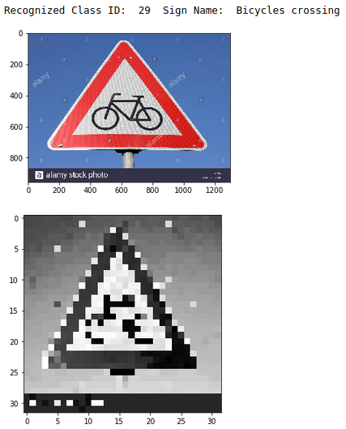

# German Traffic Sign Classification
This repository provides codes in jupyter notebook for:
- downloading german traffic sign dataset
- loading and visualization of samples of the train dataset
- preprocessing all images before being used for training the model and testing.
- augmentation of dataset using keras ImageDataGenerator for training
- create, build and train a multiclass classification CNN model to recognize german traffic signs
- evaluation of model on the test dataset
- recognition on a test image using url

--------------------------------------
Dataset used for training, validation and testing
- Link: https://bitbucket.org/jadslim/german-traffic-signs
- Dataset consists of 43 Traffic Signs. All the images are RGB images of (32,32) pixel resolution.
- Training Images: 34799
- Test Images: 12630
- Validation Images: 4410

Visualization of 5 images per traffic sign

Distribution of training image samples over the training dataset

--------------------------------------
Preprocessing of images is done with
- conversion of image to grayscale image
- histogram equalization of grayscale image to improve contrast of the image
- normalization of pixel value to range of 0 to 1

--------------------------------------
Data augmentation is performed using ImageDataGenerator for increasing the number of training samples. Below is visualization of sample augmented images after preprocessing of training dataset.

--------------------------------------
CNN model created for training
- Convolutional layer with 64 filters with kernel size (5,5)
- Relu activation layer
- Convolutional layer with 64 filters with kernel size (5,5)
- Relu activation layer
- Max pooling layer with pool size (2,2)
- Convolutional layer with 32 filters with kernel size (3,3)
- Relu activation layer
- Convolutional layer with 32 filters with kernel size (3,3)
- Relu activation layer
- Max pooling layer with pool size (2,2)
- Fully connected layer with 512 units
- Relu activation layer with dropout rate of 50%
- Output layer for 43 classes with softmax activation classifier
- Adam optimizer with learning rate=0.001 is used for updating the model parameters.
- Categorical cross-entropy is used for loss and accuracy is used as performance metric.

--------------------------------------
Model is trained for 5 epochs with 2000 iterations per epoch and 50 images per iteration

Model's performance after 5 epochs of training on :
-   Training dataset loss --> 0.0952 and accuracy --> 97.1%
- Validation dataset loss --> 0.0434 and accuracy --> 98.59%
-       Test dataset loss --> 0.0916 and accuracy --> 97.28%

--------------------------------------
Result of recognition using a test image from a url: https://c8.alamy.com/comp/J2MRAJ/german-road-sign-bicycles-crossing-J2MRAJ.jpg

